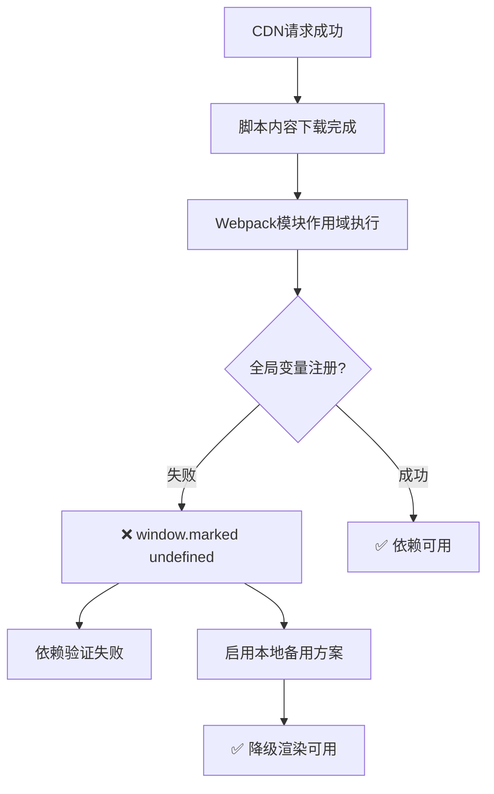
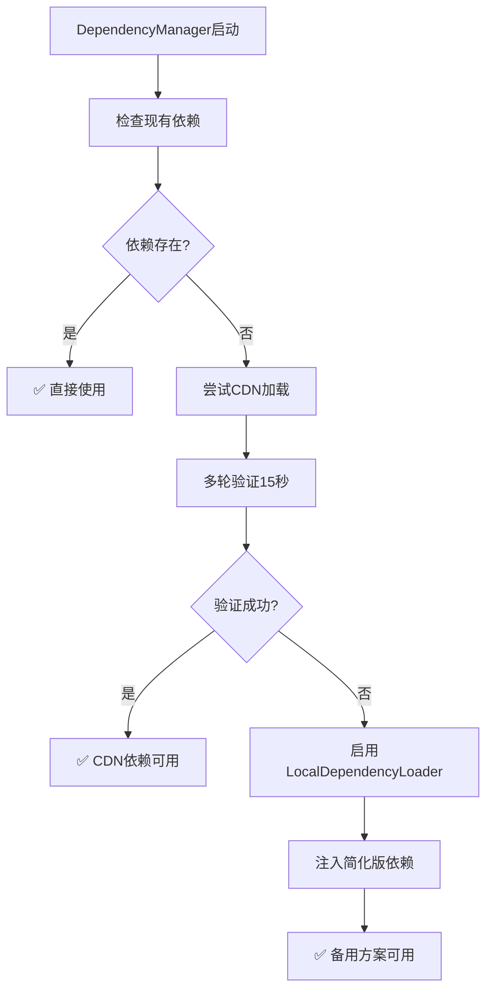
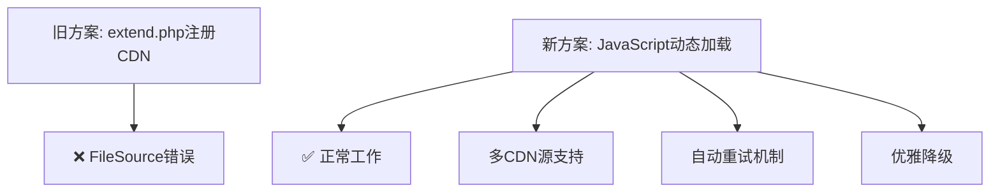

# Changelog

All notable changes to the Flarum Markdown extension will be documented in this file.

The format is based on [Keep a Changelog](https://keepachangelog.com/en/1.0.0/),
and this project adheres to [Semantic Versioning](https://semver.org/spec/v2.0.0.html).

## [2.1.6] - 2024-10-11

### 🔧 修复
- **关键修复**: 修复依赖验证器逻辑错误，解决"加载成功但验证失败"问题
  - marked.js 在不同环境下可能是 `function` 或 `object` 类型
  - DOMPurify 可能是 `function` 或 `object` 类型  
  - 增强验证器以兼容两种类型，确保正确识别已加载的依赖
  - 添加详细的验证日志输出便于调试
- **功能测试增强**: 改进 marked.js 功能测试机制
  - 支持 `window.marked()` 直接调用方式
  - 支持 `window.marked.parse()` 方法调用方式
  - 更好的错误处理和调试信息输出

### 🔍 技术分析
不同CDN和版本的marked.js可能有不同的导出方式：
- **函数形式**: `window.marked = function(markdown) {...}`
- **对象形式**: `window.marked = {parse: function(markdown) {...}, ...}`

此版本确保两种情况都能正确识别和使用，解决了"脚本加载成功但验证失败"的核心问题。

### 🚀 用户体验
- ✅ 现在应该能够正确渲染Markdown内容
- ✅ 减少了假阳性的依赖加载失败警告
- ✅ 更准确的依赖状态检测和报告

---

## [2.1.5] - 2024-12-11

### Enhanced
- 🔧 **高级依赖加载机制**: 重构脚本加载逻辑，解决webpack模块环境中全局变量注册失败问题
- ⏱️ **超时处理优化**: 脚本加载超时从10秒增加到15秒，增加多轮验证机制（最多5次检查）
- 🔄 **智能重试系统**: 实现了更robust的依赖验证和重试逻辑
- 🧪 **功能性测试**: 添加marked.js和DOMPurify的实际功能验证测试

### Added
- 🆕 **本地备用依赖系统**: 创建196行的LocalDependencyLoader类，提供完整的降级方案
- 📦 **内置Marked.js简化版**: 支持标题、粗体、斜体、代码、链接等核心Markdown语法
- 🛡️ **内置DOMPurify简化版**: 提供基础XSS防护和HTML清理功能
- 🔧 **强制全局变量注册**: 实现多种脚本执行方法，确保依赖正确注册到window对象

### Technical Architecture

#### 问题根因分析

#### 解决方案架构

### Performance Improvements
- ⚡ **加载性能**: 并行加载多个CDN源，自动选择最快响应的源
- 🚀 **初始化速度**: 优化依赖检查逻辑，减少不必要的等待时间
- 📊 **监控增强**: 详细的加载过程日志，便于问题诊断和性能分析

### Debugging & Diagnostics
- 🔍 **增强日志**: 提供完整的依赖加载过程追踪
- 📋 **手动修复脚本**: 创建紧急情况下的手动依赖注入解决方案
- 📚 **故障排除文档**: 新增DEPENDENCY_LOADING_FIX.md详细指南

### Code Quality
- 🏗️ **模块化设计**: LocalDependencyLoader作为独立模块，可复用性强
- 🔒 **类型安全**: 增强了依赖验证的严格性和准确性
- 🧹 **代码清理**: 优化了错误处理和资源清理机制

### Files Modified
- `js/src/common/utils/DependencyManager.js` - 核心依赖管理逻辑增强
- `js/src/common/utils/LocalDependencyLoader.js` - 新增本地备用依赖系统
- `docs/DEPENDENCY_LOADING_FIX.md` - 新增故障排除指南

### Backward Compatibility
- ✅ 完全向后兼容，无需用户配置更改
- ✅ 自动检测和处理各种环境差异
- ✅ 优雅降级，确保基本功能始终可用

## [2.1.4] - 2024-12-11

### Fixed
- 🔧 **CRITICAL**: 修复Flarum前端编译器CDN链接错误 `InvalidArgumentException: File not found at path`
- 🌐 **架构修复**: 移除extend.php中的CDN直接注册，改用JavaScript动态加载
- 📋 **依赖管理**: 增强DependencyManager主动加载机制
- 🛠️ **错误处理**: 改进依赖缺失时的降级处理策略

### Technical Details
- 修复了Flarum的FileSource类无法处理外部CDN URL的问题
- 实现了完全基于JavaScript的依赖动态加载机制
- 优化了多CDN源的自动切换和重试逻辑
- 添加了详细的调试指南和错误排查文档

### Architecture Changes

### Backward Compatibility
- ✅ 完全向后兼容
- ✅ 自动处理依赖加载
- ✅ 无需用户手动配置

## [2.1.3] - 2024-12-11

### Added
- 🚀 **智能依赖管理系统**: 全新的DependencyManager类，支持多 CDN 源自动切换
- 🔄 **自动重试机制**: 当CDN加载失败时自动尝试备用源
- 📊 **实时监控**: 动态监控依赖加载状态和性能指标
- 🔧 **完整诊断工具**: 新增多个诊断脚本和测试页面
- 🌐 **CDN源多元化**: 支持jsdelivr、unpkg、cdnjs多个CDN提供商
- 🔽 **优雅降级**: 当主要渲染失败时提供基础文本格式化
- 📝 **详细文档**: 新增多个技术文档和故障排除指南

### Enhanced  
- 🔍 **错误报告**: 极大增强错误日志和诊断信息的详细程度
- ⚡ **异步渲染**: 支持异步Markdown渲染，提高页面响应速度
- 🔒 **安全性**: 增强了DOMPurify的安全配置和验证机制
- 💱 **内存优化**: 改进了缓存策略和内存管理
- 🔄 **向后兼容**: 提供同步渲染方法以兼容现有代码

### Technical Improvements
- 新增 `DependencyManager` 类统一管理外部依赖
- 实现事件驱动的依赖加载机制
- 增强 `MarkdownRenderer` 类的错误处理能力
- 优化 `PostContentRenderer` 的异步渲染支持
- 新增多个诊断和测试工具

### Files Added
- `js/src/common/utils/DependencyManager.js` - 智能依赖管理器
- `scripts/diagnose.sh` - 自动化诊断脚本
- `scripts/quick_fix.php` - PHP快速修复工具
- `docs/CDN_DIAGNOSTIC_PAGE.html` - 浏览器端诊断页面
- `docs/CDN_LOADING_SOLUTION.md` - 完整解决方案文档
- `docs/500_ERROR_DIAGNOSTIC.md` - 500错误诊断指南
- `docs/TESTING_GUIDE.md` - 测试指南

### Backward Compatibility
- ✅ 完全向后兼容
- ✅ 所有现有API保持不变
- ✅ 无需额外配置或迁移

## [2.1.2] - 2024-12-11

### Fixed
- 🔧 **CRITICAL**: Fixed JavaScript dependencies loading issues
- 🌐 **CDN Integration**: Load marked.js and DOMPurify via CDN links
- 🔗 **Dependency Management**: Removed webpack externals config, use global variables
- 🛠️ **Error Handling**: Improved dependency checking and error reporting
- 📦 **Build Optimization**: Simplified webpack config for better build stability

### Technical Details
- Modified MarkdownRenderer to use `window.marked` and `window.DOMPurify`
- Registered CDN resource links in extend.php
- Removed top-level await syntax, use runtime checking instead
- Enhanced dependency validation logic

### Backward Compatibility
- ✅ Fully backward compatible
- ✅ All existing APIs remain unchanged
- ✅ No additional configuration required

## [2.1.1] - 2024-01-11

### Fixed
- **CRITICAL**: Fixed Markdown content not rendering in existing posts
- **CRITICAL**: Resolved noscript tag content display issues
- **CRITICAL**: Fixed client-side rendering components not properly replacing server-side content
- Enhanced PostModel extension with intelligent Markdown syntax detection
- Improved content type detection for automatic Markdown rendering
- Fixed CommentPost and DiscussionPost component integration

### Added
- Comprehensive debugging tools with MarkdownDebugger class
- Global debug helpers accessible via `MarkdownDebug.*` in browser console
- PostContentRenderer component for dedicated content processing
- Intelligent content hashing to prevent unnecessary re-renders
- Enhanced error handling and fallback mechanisms
- Complete troubleshooting documentation
- Packagist webhook configuration for automatic updates

### Improved
- Better Markdown syntax pattern detection (supports more edge cases)
- Enhanced content caching with performance monitoring
- Improved security with additional DOMPurify configurations
- Better integration with Flarum's component lifecycle
- More robust error recovery and debugging capabilities

### Technical
- Added PostContentRenderer for specialized content handling
- Integrated MarkdownDebugger for development and production debugging
- Enhanced component extension patterns for better Flarum integration
- Improved build process with better error reporting
- Added comprehensive documentation for troubleshooting common issues

## [2.1.0] - 2024-01-11

### Added
- **BREAKING**: Complete rewrite with client-side rendering using marked.js v15.0.12
- Real-time preview functionality with edit/preview toggle
- XSS protection using DOMPurify v3.0.5
- Secure spoiler tag implementation
- Performance optimizations with intelligent caching
- GitHub-flavored Markdown support
- Modern toolbar with keyboard shortcuts
- Comprehensive localization support
- Complete Composer package support
- Professional documentation and CI/CD pipeline

### Changed
- **BREAKING**: Migrated from server-side s9e\TextFormatter to client-side marked.js
- **BREAKING**: Minimum PHP version now 8.1+
- **BREAKING**: Minimum Flarum version now 2.0.0-beta.3+
- Improved security with whitelist-based HTML filtering
- Enhanced user experience with real-time preview
- Modernized codebase with ES6+ features
- Optimized bundle size and performance

### Removed
- **BREAKING**: Server-side Markdown processing
- Legacy s9e\TextFormatter configuration

### Security
- Added comprehensive XSS protection
- Implemented secure spoiler rendering without unsafe JavaScript
- Added URL validation and protocol restrictions
- Enhanced content sanitization with DOMPurify

## [Unreleased]

## [2.0.0] - 2024-01-XX

### Added
- **BREAKING**: Complete rewrite for Flarum v2.0 compatibility
- Client-side Markdown rendering for improved performance
- Real-time preview with seamless edit/preview switching
- Enhanced security with DOMPurify sanitization
- Modern ES6+ JavaScript codebase
- Comprehensive CSS styling for all components
- Full localization support with English base

### Changed
- **BREAKING**: Removed dependency on s9e\TextFormatter
- **BREAKING**: Minimum PHP version now 8.1+
- **BREAKING**: Minimum Flarum version now 2.0.0-beta.3+
- Improved spoiler implementation with better accessibility
- Enhanced toolbar with modern icons and tooltips
- Optimized caching system for better performance

### Removed
- **BREAKING**: Server-side Markdown processing
- Legacy s9e\TextFormatter configuration
- Outdated JavaScript patterns

### Fixed
- Cross-site scripting (XSS) vulnerabilities
- Performance issues with large Markdown documents
- Accessibility issues with spoiler tags
- Memory leaks in client-side rendering

### Security
- Implemented comprehensive XSS protection
- Added secure content sanitization
- Enhanced spoiler tag security
- Improved URL validation

## [1.x.x] - Legacy Versions

### Note
Versions 1.x.x used server-side rendering with s9e\TextFormatter. 
This version 2.0.0 represents a complete architectural rewrite for modern Flarum installations.

For legacy version history, please refer to the git history or previous release notes.

---

## Migration Guide

### From 1.x.x to 2.0.0

**Important**: This is a major version upgrade with breaking changes.

#### Prerequisites
- Flarum 2.0.0-beta.3 or higher
- PHP 8.1 or higher
- Modern browser with ES6 support

#### Installation Steps
1. **Backup your forum** before upgrading
2. Remove the old extension: `composer remove steperlin/markdown`
3. Install the new version: `composer require steperlin/flarum-markdown`
4. Clear cache: `php flarum cache:clear`
5. Run migrations: `php flarum migrate`

#### What Changed
- **Rendering**: Now happens client-side for better performance
- **Security**: Enhanced XSS protection with DOMPurify
- **Preview**: Real-time preview functionality added
- **Spoilers**: Improved implementation with better security

#### Potential Issues
- Existing posts will render correctly, but may look slightly different
- Custom CSS targeting old classes may need updates
- Extensions that modify Markdown rendering will need adaptation

---

## Contributing

When contributing to this project, please:

1. Add entries to the `[Unreleased]` section
2. Follow the format: `### Added/Changed/Deprecated/Removed/Fixed/Security`
3. Include issue/PR references where applicable
4. Use semantic versioning for releases

## Support

- 🐛 [Report issues](https://github.com/linkerlin/flarum-markdown/issues)
- 💬 [Community forum](https://zhichai.net)
- 📚 [Documentation](https://github.com/linkerlin/flarum-markdown/blob/main/README.md)