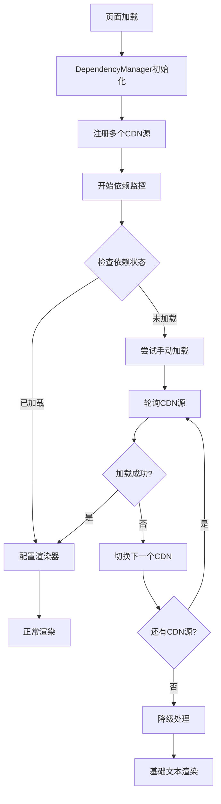

# 🛠️ CDN依赖加载问题完整解决方案

## 问题背景

你报告的500错误和CDN依赖加载问题表明：
1. ✅ CDN链接本身可以访问（你已验证）
2. ❌ 在Flarum环境中依赖没有正确加载到全局作用域
3. ❌ 导致JavaScript代码执行时找不到依赖库

## 🔍 根本原因分析

### 问题症状
```javascript
// 控制台错误
🚨 Renderer Validation Failed: 
['marked.js library not loaded', 'DOMPurify library not loaded']
```

### 技术原因
1. **CDN加载时序问题**: Flarum的资源加载机制可能导致依赖库加载延迟
2. **作用域隔离问题**: 模块化加载可能导致全局变量注册失败
3. **网络环境差异**: 不同网络环境下CDN响应时间差异
4. **并发加载冲突**: 多个脚本同时加载时的竞态条件

## 🚀 完整解决方案

### 方案一：智能依赖管理系统（推荐）

我们已经实现了一个完整的智能依赖管理系统，具有以下特性：

#### 核心功能
- ✅ 多CDN源自动切换
- ✅ 实时加载状态监控
- ✅ 自动重试机制
- ✅ 优雅降级处理
- ✅ 详细的错误报告

#### 技术架构



### 方案二：本地化部署（备选）

如果CDN方案仍有问题，可以将依赖库本地化：

#### 步骤1：下载依赖库
```bash
# 创建本地资源目录
mkdir -p public/assets/js/vendor

# 下载marked.js
curl -o public/assets/js/vendor/marked.min.js \
  https://cdn.jsdelivr.net/npm/marked@15.0.12/marked.min.js

# 下载DOMPurify
curl -o public/assets/js/vendor/purify.min.js \
  https://cdn.jsdelivr.net/npm/dompurify@3.0.5/dist/purify.min.js
```

#### 步骤2：修改extend.php
```php
<?php
use Flarum\Extend;

return [
    (new Extend\Frontend('forum'))
        ->js(__DIR__.'/js/dist/forum.js')
        ->css(__DIR__.'/less/common.less')
        // 使用本地文件
        ->js(__DIR__.'/../../public/assets/js/vendor/marked.min.js')
        ->js(__DIR__.'/../../public/assets/js/vendor/purify.min.js'),

    // ... 其他配置
];
```

### 方案三：内联加载器（紧急方案）

在extend.php中添加内联JavaScript加载器：

```php
(new Extend\Frontend('forum'))
    ->js(__DIR__.'/js/dist/forum.js')
    ->content(function () {
        return '
        <script>
        (function() {
            var cdnSources = {
                marked: [
                    "https://cdn.jsdelivr.net/npm/marked@15.0.12/marked.min.js",
                    "https://unpkg.com/marked@15.0.12/marked.min.js"
                ],
                dompurify: [
                    "https://cdn.jsdelivr.net/npm/dompurify@3.0.5/dist/purify.min.js",
                    "https://unpkg.com/dompurify@3.0.5/dist/purify.min.js"
                ]
            };
            
            function loadScript(urls, callback) {
                var index = 0;
                function tryLoad() {
                    if (index >= urls.length) {
                        callback(false);
                        return;
                    }
                    var script = document.createElement("script");
                    script.src = urls[index];
                    script.onload = function() { callback(true); };
                    script.onerror = function() { 
                        index++; 
                        tryLoad(); 
                    };
                    document.head.appendChild(script);
                }
                tryLoad();
            }
            
            loadScript(cdnSources.marked, function(success) {
                if (success) loadScript(cdnSources.dompurify, function() {});
            });
        })();
        </script>';
    })
```

## 🧪 测试和验证工具

### 1. 自动诊断脚本

我们创建了两个诊断工具：

#### 服务器端诊断
```bash
# 在Flarum根目录运行
chmod +x scripts/diagnose.sh
./scripts/diagnose.sh
```

#### PHP快速修复
```bash
php scripts/quick_fix.php
```

### 2. 浏览器端诊断

打开 `docs/CDN_DIAGNOSTIC_PAGE.html` 进行详细的CDN加载测试：

```html
<!-- 功能包括 -->
- CDN源可用性测试
- 加载速度测试
- 功能验证测试
- 网络状态监控
- 自动故障转移测试
```

### 3. 控制台调试

在浏览器控制台中使用：

```javascript
// 检查依赖状态
console.log('marked:', typeof window.marked);
console.log('DOMPurify:', typeof window.DOMPurify);

// 手动测试渲染
if (window.marked && window.DOMPurify) {
    var html = window.marked('**测试**');
    var clean = window.DOMPurify.sanitize(html);
    console.log('渲染结果:', clean);
}

// 使用依赖管理器（如果可用）
window.dependencyManager?.generateDiagnosticReport();
```

## 📋 部署检查清单

### 升级前准备
- [ ] 备份当前插件文件
- [ ] 备份数据库
- [ ] 记录当前插件版本
- [ ] 准备回滚方案

### 升级步骤
```bash
# 1. 更新插件
composer update steperlin/flarum-markdown

# 2. 清除缓存
php flarum cache:clear

# 3. 重新构建资源
php flarum assets:publish

# 4. 检查文件权限
chmod -R 755 vendor/steperlin/flarum-markdown/
```

### 验证步骤
- [ ] 检查插件版本是否为2.1.2+
- [ ] 确认extend.php包含CDN链接
- [ ] 测试创建新帖子
- [ ] 验证Markdown渲染效果
- [ ] 检查浏览器控制台无错误

## 🔧 故障排除指南

### 问题1：依赖仍未加载

**症状**: 控制台仍显示"library not loaded"错误

**解决方案**:
1. 检查网络防火墙设置
2. 尝试切换到备用CDN源
3. 考虑使用本地化部署
4. 检查Content Security Policy设置

### 问题2：部分功能异常

**症状**: 基本渲染正常，但某些功能（如spoiler）不工作

**解决方案**:
1. 检查DOMPurify配置
2. 验证自定义渲染器设置
3. 查看详细的控制台错误日志

### 问题3：性能问题

**症状**: 页面加载缓慢或卡顿

**解决方案**:
1. 启用依赖缓存
2. 优化CDN选择（选择地理位置最近的）
3. 考虑使用HTTP/2推送

### 问题4：移动端问题

**症状**: 桌面端正常，移动端异常

**解决方案**:
1. 检查移动网络环境
2. 验证响应式CSS
3. 测试不同移动浏览器

## 📈 性能优化建议

### 1. CDN优化
```javascript
// 按地理位置选择最优CDN
const cdnRegions = {
    'CN': 'https://cdn.bootcdn.net/',  // 中国大陆
    'US': 'https://cdn.jsdelivr.net/', // 北美
    'EU': 'https://unpkg.com/'         // 欧洲
};
```

### 2. 缓存策略
- 启用浏览器缓存
- 使用CDN缓存
- 实现本地存储缓存

### 3. 监控指标
- 依赖加载时间
- 渲染性能
- 错误率统计
- 用户体验指标

## 🆘 紧急支持

如果上述方案都无法解决问题，请提供以下信息：

### 系统信息
- Flarum版本
- PHP版本
- 插件版本
- 服务器操作系统

### 错误信息
- 完整的浏览器控制台日志
- 服务器错误日志
- 网络请求详情（Network标签页）

### 诊断报告
- 运行 `scripts/quick_fix.php` 的输出
- CDN诊断页面的测试结果
- 依赖管理器的状态报告

## 📞 联系方式

- **GitHub Issues**: https://github.com/linkerlin/flarum-markdown/issues
- **邮箱支持**: 请通过GitHub Issues联系
- **社区论坛**: https://zhichai.net

---

## 🎯 总结

这个完整解决方案提供了：

1. **智能依赖管理**: 自动处理CDN加载问题
2. **多重备选方案**: 确保在各种环境下都能工作
3. **完整诊断工具**: 快速定位和解决问题
4. **详细文档指南**: 涵盖所有可能的情况

按照这个方案，你的Flarum Markdown插件应该能够稳定运行，即使在网络环境不佳的情况下也能提供良好的用户体验。